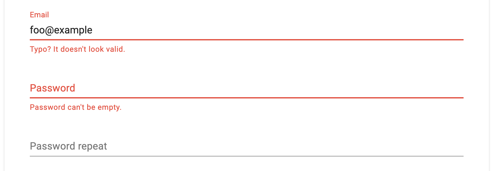

How to use `spec` for form validation and return human understandable errors? Should you at all?

(this article is also a solution for `clojure.spec` on backend when you need to return human readable errors for invalid values)

<!--more-->

## Why use spec for form validation?

Because you already use `spec` in system. Otherwise you will have to keep the same validations in two different definitions. For example `spec` and plumatic schema. You will fail keeping them equal on backend and frontend. You want to decrease complexity and keep system as simple as possible.

You can use the same `spec` definitions files (`.cljc`) in Clojure and ClojureScript, so on backend and frontend.

If you don't use `spec` yet, it is worth to think about unify data validation in your system to one format in a whole system.

## Purpose of the spec

> The spec library specifies the structure of data, validates or conforms it, and can generate data based on the spec.
> <cite>[spec guide](https://clojure.org/guides/spec)</cite>

What does it really mean? Let me explain it short step by step using code.

### Specifies the structure of data

```clojure
(s/def ::id (s/and pos-int?))
(s/def ::email (s/and string? (partial re-matches #"^[a-zA-Z0-9._%+-]+@[a-zA-Z0-9.-]+\.[a-zA-Z]{2,63}$")))
```

### Validates

```clojure
(s/valid? ::id 1)
=> true
(s/valid? ::id 0)
=> false
```

### Conforms

```clojure
(s/def ::name-or-id (s/or :name string?
                          :id ::id))
(s/conform ::name-or-id 1)
=> [:id 1]
(s/conform ::name-or-id "foo")
=> [:name "foo"]
(s/conform ::name-or-id 0)
=> :clojure.spec.alpha/invalid
```

### Generate data

```clojure
(gen/sample (s/gen ::id))
=> (2 1 1 3 1 6 1 2 8 2)
(gen/generate (s/gen ::id))
=> 86
```

## The challenge

Here is the point. These things you have to code yourself on top of the `spec`.

### Constraint validation

Validate values which depend on other values. For example: check if date of birth is lower than date of graduation or check if password repeat is equal.

While it is technically possible to do constraint validation by `spec`, there is no way to know field name of the input, which causes the error.

To show the issue I have to start from a simple validation.

```clojure
(s/def ::email (s/and string? (partial re-matches #"^[a-zA-Z0-9._%+-]+@[a-zA-Z0-9.-]+\.[a-zA-Z]{2,63}$")))

(s/def ::password-not-empty not-empty)
(s/def ::password-length #(<= 6 (count %)))
(s/def ::password (s/and string? ::password-not-empty ::password-length))

(s/def ::form (s/keys :req-un [::email ::password]))

(s/explain-data ::form {:email "foo@example.com"
                        :password "qwas"})
=>
{:problems ({:path [:password],
             :pred (cljs.core/fn [%] (cljs.core/<= 6 (cljs.core/count %))),
             :val "qwas",
             :via [:foo/form :foo/password :foo/password-length],
             :in [:password]}),
 :spec :foo/form,
 :value {:email "foo@example.com", :password "qwas"}}
```

Here you can read `password` input by `:in`. This is the only one way to know which value invalidated in a map data structure.

```clojure
(first (:in (s/explain-data ...)))
=> :password
```

Now the issue about constraint validation. You can't compare password in `(s/spec ::password-repeat ...)`, because on that level `spec` let you know only the value of `::password-repeat`, but no other map values including `::password`. This is why you have to do constraint validation on the first level of`(s/def ::form-constraint ...)` where you can't read the name of the value which is invalid.

```clojure
(s/def ::password-equal? (fn [{:keys [password password-repeat]}]
                           (= password password-repeat)))

(s/def ::form-constraint (s/and (s/keys :req-un [::email ::password])
                                ::password-equal?))

(s/explain-data ::form-constraint {:email "foo@example.com"
                                   :password "qwaszx"
                                   :password-repeat "q"})
=>
#:cljs.spec.alpha{:problems [{:path [],
                              :pred (cljs.core/fn [{:keys [password password-repeat]}] (cljs.core/= password password-repeat)),
                              :val {:email "foo@example.com", :password "qwaszx", :password-repeat "q"},
                              :via [:foo/form-constraint :foo/password-equal?],
                              :in []}],
                  :spec :foo/form-constraint,
                  :value {:email "foo@example.com", :password "qwaszx", :password-repeat "q"}}
```

`:in` is empty. Where will you display this error on the screen?

To make it easier for you, here is a visualsation of the issue. Application can't determine the `:password-repeat` input is invalid from the data above.

[](form.png)

### Human readable errors

```clojure
(s/explain-data ::id 0)
=>
#:clojure.spec.alpha{:problems [{:path [],
                                 :pred clojure.core/pos-int?,
                                 :val 0,
                                 :via [:foo/id],
                                 :in []}],
                     :spec :foo/id,
                     :value 0}
```

This is a simple, not nested data structure. With more complex data it is unreadable at all. It is designed to read by application, not for humans (end users).

## Make a solution

It is time to code a final solution.

### Validate and return `:via`

Return `nil` if validate, oterwise `:via`.

```clojure
(s/def ::email (s/and string? (partial re-matches #"^[a-zA-Z0-9._%+-]+@[a-zA-Z0-9.-]+\.[a-zA-Z]{2,63}$")))

(s/def ::password-not-empty not-empty)
(s/def ::password-length #(<= 6 (count %)))
(s/def ::password (s/and string? ::password-not-empty ::password-length))

(s/def ::form (s/keys :req-un [::email ::password]))
```

```clojure
(defn ?spec-problems
  "Return nil if pass."
  [spec value]
  (-> (s/explain-data spec value)
      :cljs.spec.alpha/problems))

(defn spec-validate
  "Check value by spec.
  If validate return nil,
  otherwise return a reason: the :via value of spec problem."
  [spec value]
  (->> (?spec-problems spec value)
       (first)
       :via))

(spec-validate ::form {:email "foo@example.com"
                       :password "qwaszx"})
=> nil

(spec-validate ::form {:email "foo@example.com"
                       :password "qwas"})
=> [:foo/form :foo/password :foo/password-length]
```

### Change `:via` vector to the error message

You have `[:foo/form :foo/password :foo/password-length]`.
Now change it into a message. Check if you have a message for `spec` definition one by one from back.

```clojure
(defn get-message
  [via messages]
  (->> (reverse via)
       (some messages)))


(get-message [:foo/form :foo/password :foo/password-length]
             {:foo/password "Not satisfy security rules."})
=> "Not satisfy security rules."

(get-message [:foo/form :foo/password :foo/password-length] 
             {:foo/password-length "Needs to be more, than 6 characters."
              :foo/password "Not satisfy security rules."})
=> "Needs to be at least 6 characters."
```

**You have learnt how to return human redable error message from `spec` validation.**

### Constraint valiadtion

Use cases:

1. Password repeat - you don't want to have `spec` for this. You don't use this value at all and don't send in API. It is only needed to show an error on screen. Use `fn` instead for this one.
2. `(< brith graduation)` - you probably want to use `spec`, because you use this data in the system.

What can you do about that?

Add an extra code in user interface to show an error message for graduation field

1. if `:in` is `[::graduation]`
2. or when `:in` is `[]` and `:via` contain `::birth<graduation`.

This let you show the error message in right place of the user interface.

### Trick about mirroring `s/def` and `:via`

```clojure
(s/def ::instant (partial s/valid? inst?))
(s/def ::created ::instant)

(s/explain-data ::created 0)
=>
#:cljs.spec.alpha{:problems [{:path [], 
                              :pred (cljs.core/partial cljs.spec.alpha/valid? cljs.core/inst?),
                              :val 0,
                              :via [:foo/created],
                              :in []}],
                  :spec :foo/created, :value 0}
```

`:via` doesn't contain full path. You can't set an error message for `::instant`. But here is a trick.

```clojure
(s/def ::created (s/and ::instant))
(s/explain-data ::created 0)
=>
#:cljs.spec.alpha{:problems [{:path [], 
                              :pred (cljs.core/partial cljs.spec.alpha/valid? cljs.core/inst?),
                              :val 0,
                              :via [:foo/created :foo/instant],
                              :in []}],
                  :spec :form-validator-doc.spec/created, :value 0}
```

Now `:via` contain full path.

**You achieved full knowledge how to validate data using `spec` and return error messages for end users.**

## Final solution

On the end you want to have a library to do all this things which I mentioned. Because it is something repeatable in each project in the same way.

Good news. I did all this work for you and made a library [form validation](https://github.com/kwladyka/form-validator-cljs). You can use this in your project and you can learn more tricks from analysing the code.

Let me show you [live demo of form validation](https://kwladyka.github.io/form-validator-cljs/).