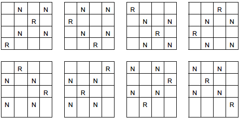

I describe how to improve performance based on my real experience during chess challenge. No theory, real use case.

<!--more-->

This article is connected with [https://github.com/kwladyka/chess-challenge](https://github.com/kwladyka/chess-challenge). Look at this small project, it is recommend to understand what I am talking about in this article.

Do not worry if you don't understand the code. It is about conclusions, not about code in every line.

## Do not use memory if you don't have to

**Find heuristic methods to filter existing data instead of creating new.**

For example, we want to check on chessboard if a piece captures any other pieces and count safe squares.

```clojure
(defn squares-capture-by-king [_ [col row]]
  [[(dec col) (dec row)]
   [col (dec row)]
   [(inc col) (dec row)]
   [(dec col) row]
   [(inc col) row]
   [(dec col) (inc row)]
   [col (inc row)]
   [(inc col) (inc row)]])

(defn squares-capture-by-knight [_ [col row]]
  [[(dec col) (- row 2)]
   [(inc col) (- row 2)]
   [(- col 2) (dec row)]
   [(+ col 2) (dec row)]
   [(dec col) (+ row 2)]
   [(inc col) (+ row 2)]
   [(- col 2) (inc row)]
   [(+ col 2) (inc row)]])

(defn squares-capture-by-bishop [[cols rows] [col row]]
  (apply concat
         (for [x (range 1 (inc (min cols rows)))]
           [[(- col x) (- row x)]
            [(+ col x) (+ row x)]
            [(- col x) (+ row x)]
            [(+ col x) (- row x)]])))

(defn squares-capture-by-rook [[cols rows] [col row]]
  (remove #{[col row]}
          (concat
            (map vector
                 (range 1 (inc cols))
                 (repeat cols row))
            (map vector
                 (repeat rows col)
                 (range 1 (inc rows))))))

(defn squares-capture-by-queen [[cols rows] [col row]]
  (concat
    (squares-capture-by-rook [cols rows] [col row])
    (squares-capture-by-bishop [cols rows] [col row])))

(defn remove-positions-outside-board [[cols rows] squares]
  (filter (fn [[col row]]
            (and
              ((every-pred pos? #(<= % cols)) col)
              ((every-pred pos? #(<= % rows)) row)))
          squares))

(defn capture-squares [board-size piece]
  (->> (case (val piece)
         :king (squares-capture-by-king board-size (key piece))
         :queen (squares-capture-by-queen board-size (key piece))
         :bishop (squares-capture-by-bishop board-size (key piece))
         :rook (squares-capture-by-rook board-size (key piece))
         :knight (squares-capture-by-knight board-size (key piece)))
       (remove-positions-outside-board board-size)
       (apply hash-set)))
```

What are we doing here? We are getting the piece and count which squares this piece captures. After that, we can check if this piece captures others pieces and remove captured squares from safe squares on the chessboard.

So if we call

```clojure
(capture-squares [4 4] (first {[1 1] :rook}))
```

we will get

```clojure
#{[4 1] [1 4] [1 3] [3 1] [2 1] [1 2]}
```

It is intuitive and works, but it has bad performance!

Now consider other heuristic solution of the same problem:

```clojure
(defn rook-capture-square? [[rook-col rook-row] [col row]]
  (or (= col rook-col)
      (= row rook-row)))

(defn bishop-capture-square? [[^long bishop-col ^long bishop-row]
                              [^long col ^long row]]
  (= (Math/abs (- col bishop-col))
     (Math/abs (- row bishop-row))))

(defn queen-capture-square? [queen-square square]
  (or
    (rook-capture-square? queen-square square)
    (bishop-capture-square? queen-square square)))

(defn king-capture-square? [[^long king-col ^long king-row]
                            [^long col ^long row]]
  (and
    (<= (Math/abs (- col king-col)) 1)
    (<= (Math/abs (- row king-row)) 1)))

(defn knight-capture-square? [[^long knight-col ^long knight-row]
                              [^long col ^long row]]
  (let [col-dif (Math/abs (- col knight-col))
        row-dif (Math/abs (- row knight-row))]
    (or
      (and (= col knight-col) (= row knight-row))
      (and (= 1 col-dif) (= 2 row-dif))
      (and (= 2 col-dif) (= 1 row-dif)))))

(defn capture? [piece-notation square]
  (->> (case (val piece-notation)
         :queen (queen-capture-square? (key piece-notation) square)
         :rook (rook-capture-square? (key piece-notation) square)
         :bishop (bishop-capture-square? (key piece-notation) square)
         :king (king-capture-square? (key piece-notation) square)
         :knight (knight-capture-square? (key piece-notation) square))))

(defn capture-any? [piece-notation squares]
  (-> (partial capture? piece-notation)
      (some squares)
      (true?)))

(defn remove-capture-squares [piece-notation squares]
  (-> (partial capture? piece-notation)
      (remove squares)))
```

Instead of counting squares captured by piece, we filter existing data with mathematical operations.

```clojure
(capture? (first {[1 1] :rook}) [1 3])
;;=> true
(capture-any? (first {[1 1] :rook}) '([2 3] [3 3] [4 2]))
;;=> false
(remove-capture-squares (first {[1 1] :rook}) '([2 3] [3 3] [1 3] [4 2]))
;;=> ([2 3] [3 3] [4 2])
```

```clojure
(solutions [7 7] '(:king :king :queen :queen :bishop :bishop :knight))
```

**takes 45 seconds with optimisation and 258 seconds without.**

## Avoid reflections

Reflections appear when you mix Java functions with Clojure without hints.

```clojure
(defn bishop-capture-square? [[^long bishop-col ^long bishop-row]
                              [^long col ^long row]]
  (= (Math/abs (- col bishop-col))
     (Math/abs (- row bishop-row))))
```

Without `^long` reflections appear and it will cost cycles on CPU when this function is used.

How to check reflections in your code? Run REPL and call:

```clojure
(set! *warn-on-reflection* true)
(require 'main-namespace :reload-all)
```

`:reload-all` is the key because it forces to reload all dependency. Warnings appear when functions are defined, not when they are used. You can also add `:global-vars {*warn-on-reflection* true}` to project.clj, but it will also show many warnings in clojure.core and another dependency makes a little mess.

[More about reflections](http://clojuredocs.org/clojure.core/*warn-on-reflection*)

```clojure
(solutions [7 7] '(:king :king :queen :queen :bishop :bishop :knight))
```

**takes 45 seconds in REPL without reflections and 506 seconds with reflections.**

## Sometimes count the same

Chessboard can be reflected and rotated. If you look at the example below for a while you can see that there are only 2 unique chessboards. Others are duplicated.



This problem is growing with the number of the same piece. For example, for 8x8 board with 8 queens numbers of duplicated boards is much bigger. In the end it has 92 solutions, but only 12 are unique. But it is not about ending solutions, it is about each solution which we count piece by piece to achieve the goal. Most of them does not pass to the end but algorithm counts duplicated boards.

What I discovered in my algorithm is that it is better to count the same (rotated and reflected) boards instead of avoiding it. The cost of avoiding is bigger than counting it. Why? Because to check if the board is duplicated in pool or not, algorithm has to create reflected/rotated boards from existing one, so I was creating new data in memory to compare. At the end of counting I had to duplicate 12 unique solutions to get all 92 solutions. So the time was longer then counting duplicated boards.

You can see that especially in more complicated example like this one where number of solutions is 3063828 and there are 4 pieces types.

```clojure
(solutions [7 7] '(:king :king :queen :queen :bishop :bishop :knight))
```

But maybe I haven't spent enough time to find solution based on filtering instead of creating new duplicated boards to compare.

**All have costs. Even optimisation to not count the same. Just do some experiments.** 

## Do not count the same

If you use [pure function](https://en.wikipedia.org/wiki/Pure_function) many times with the same input use [memoize](http://clojuredocs.org/clojure.core/memoize). Of course if you have enough memory.

## Less and clean means better

It doesn't make a direct difference in performance, but it makes your code more readable. Then you can easier see what you can improve.

For example

```clojure
(defn solutions [board-size pieces]
  (loop [sorted-pieces (sort-pieces pieces) boards (empty-boards-pool board-size)]
    (if (empty? sorted-pieces)
      boards
      (recur (rest sorted-pieces) (next-stages-of-boards boards (first sorted-pieces))))))
```

is exactly the same as

```clojure
(defn solutions [board-size pieces]
  (-> (partial next-stages-of-boards)
      (reduce (empty-boards-pool board-size) (sort-pieces pieces))))
```

But it is much easier to read that. So much easier to improve your code.

## JAR is faster then REPL

Running the same code as jar file is faster than running the same in REPL. So when you are testing production performance, test it on the jar file.

```clojure
(solutions [7 7] '(:king :king :queen :queen :bishop :bishop :knight))
```

This takes on my computer as jar file 32 seconds, but in REPL 45 seconds.

## Watch how you run code

Add to project.clj how much memory REPL can consume and with how much it will start.

```clojure
:jvm-opts ["-Xms4g" "-Xmx4g"]
```

The same with jar file

```bash
java -Xms4g -Xmx4g -jar chess-challenge.jar
```

## Useful tools

- Use Java profilers tools like (VisualVM, YourKit or another). It can give you some clue about memory and CPU usage.
- [no.dissamble](https://github.com/gtrak/no.disassemble) to inspect bytecode if all cycles on CPU matter
- [time](http://clojuredocs.org/clojure.core/time) is really simple, but useful function
- [cheatsheet](http://clojure.org/cheatsheet) to find better functions