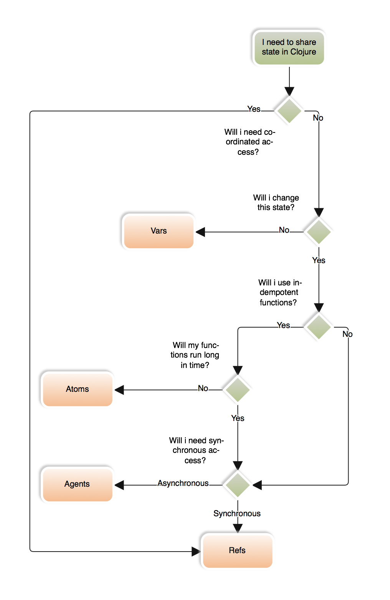

Use cases and flowchart helping decide when to use vars, atoms, agents and refs.

<!--more-->

## Vars
**Vars are global for every threads.**

They are the most common references which we use every day. 

```clojure
(def x 1)
```

When we do `(def foo "bar")` all threads will share `foo`. It is not a problem because Clojure use immutable data structures.

```clojure
(go
  (def foo :bar))
(Thread/sleep 1000)
foo

=> :bar
```

**Do not change vars after creating. It is technically possible, but it is a bad idea for many reasons.**

[read more about Vars](http://clojure.org/reference/vars) 

## Atoms

**Share access to mutable state for every thread. Change occurs synchronously. Retry when other thread changes the state during run.**

Atoms use compare-and-set model. It means that when more than one thread is trying to `swap!` the atom, they will have conflict and loop the function as long as compare-and-set passes.

So what `(swap! foo-atom inc)` really does?
1. Read value from a foo-atom as an old-value.
2. Do on this value `inc` function as a new-value.
3. Save the new-value only if foo-atom is still the old-value. If not, loop to the point 1! Unlimited times, as long as while saving the new-value atom will still have still old-value!

```clojure
(def counter (atom 0))
(def foo (atom 1))
(defn slow-inc [n]
  (swap! counter inc)
  (Thread/sleep 200)
  (inc n))

(pmap
  (fn [_]
    (swap! foo slow-inc))
  (range 100))

@counter
@foo
=> 1602
=> 101
```

What happens here? `pmap` works parallel, so all threads at "the same time" are doing `swap!` foo.  Each time when do `slow-inc`, also increase the `counter` with very fast `inc`. So probability of conflict during `swap!` `counter` is very low, but still rules are the same. But during `slow-inc` probability of conflict while saving a new-value is very high. 

1. The fastest swap! does `inc` on the foo atom from 1 to 2.
2. Others did the same operation and tried to save a new value. While saving the new value 2, compare an old value, excepting the value 1 (read the value at the beginning), however receive value 2 (other thread changed the atom). So all threads retry, read actual value 2 and inc them to 3.
3. The fastest swap! `inc` the atom from 2 to 3.
4. ...

**Do not use not idempotent functions and functions with long time execution**

[read more about Atoms](http://clojure.org/reference/atoms)

## Agents

**Share access to mutable state for every thread. Change occurs asynchronously.**

Work similar to atom, but instead of retry every time when `compare-and-set!` don't pass wait in the queue in the order they were sent, so conflict will never happen. Functions never retry, but when you `send` function you never know when it will be run. The function will be waiting in the queue.

```clojure
(def foo-agent (agent 1))

(defn slow-inc [n]
  (swap! counter inc)
  (Thread/sleep 2000)
  (inc n))

(do
  (send foo-agent slow-inc)
  (send foo-agent slow-inc)
  (println @foo-agent)
  (Thread/sleep 2500)
  (println @foo-agent)
  (Thread/sleep 2500)
  (println @foo-agent))
  
  1
  2
  3
```

1. First, `send` run and do `slow-inc`.
2. Second `send` wait in the queue. It was sent to the agent and program doesn't care about that any more. Run next lines.
3. Print value 1, because first `send` hasn't finished yet.
4. Wait and print value 2, because first `send` finished. Second `send` started counting just after first one, but didn't finish yet.
5. Wait and print 3, because second `send` finished.

[read more about Agents](http://clojure.org/reference/agents)

## Refs

**Refs works similar to database transactions. Write and read are protect in dosync. You can operate on many refs safe in transaction.**

```clojure
(def foo (ref 0))
(def bar (ref 0))

(go
  (dotimes [_ 10]
    (dosync 
      (alter foo inc)
      (Thread/sleep 1000)
      (alter bar inc)
      (println "updated, foo:" @foo "bar:" @bar))))

(go
  (dotimes [_ 10]
    (dosync
      (println "read, foo:" @foo "bar:" @bar))
    (Thread/sleep 1000)))

read, foo: 0 bar: 0
updated, foo: 1 bar: 1
read, foo: 1 bar: 1
updated, foo: 2 bar: 2
read, foo: 2 bar: 2
updated, foo: 3 bar: 3
read, foo: 3 bar: 3
updated, foo: 4 bar: 4
read, foo: 4 bar: 4
updated, foo: 5 bar: 5
read, foo: 5 bar: 5
updated, foo: 6 bar: 6
read, foo: 6 bar: 6
updated, foo: 7 bar: 7
read, foo: 7 bar: 7
updated, foo: 8 bar: 8
read, foo: 8 bar: 8
updated, foo: 9 bar: 9
read, foo: 8 bar: 8
updated, foo: 10 bar: 10
```

As we can see ,we can change many refs in one transaction and commit this changes like in database after whole dosync.

[read more about Refs](http://clojure.org/reference/refs)

## The choice flowchart

So at least, when to use which one?

[](flowchart-share-state.png)

> **Idempotent** operation is the one that has no additional effect if it is called more than once with the same input parameters.

> **Coordinated** access is used when two Identities need to be changed together, the classic example is moving money from one bank account to another, it needs to either move completely or not at all.

> **Uncoordinated** access is used when only one Identity needs to update, this is a very common case.

> **Synchronous** access is where the call expects to wait until all the identities are settled before continuing.

> **Asynchronous** access is "fire and forget" and let the Identity reach its new state in its own time.